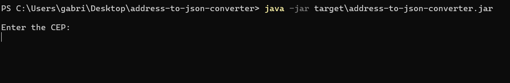
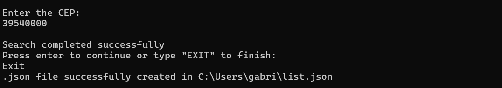

# Address to JSON converter

Java CLI application that queries an API to obtain addresses and convert them to JSON format.

---

## Getting started
To run the project, you will need to install the following programs:
- [JDK 17: Required to run the Java project](https://www.oracle.com/java/technologies/downloads/?er=221886#java17)
- [Maven 3.9.9: Required to build the Java project](https://maven.apache.org/download.cgi)

### Installing
Clone the repository
```
git clone https://github.com/gabriellrocha/address-to-json-converter.git
```
Or download the zip by clicking [here](https://github.com/gabriellrocha/address-to-json-converter/archive/refs/heads/main.zip).
 If you are careful with the .zip required, you will need to unzip it to a directory of your choice

### Build
Navigate to the root folder `.\address-to-json-converter` and type in CMD:
```
mvn clean install 
```
The command will download all project dependencies and create a target directory with the built artifacts,
which includes the project jar file.

### Execute
In the same directory run:

```
java -jar target\address-to-json-converter.jar
```

Everything going as expected you will see the following message in the terminal



---
## Features
* Enter the zip code of the desired address to obtain the information. When you want to close, type "EXIT". The .json
file will be generated in the current user's directory<br> `C:\users\{your-user}\list.json` containing the searched addresses



---

⌨️ with ❤️ by [Gabriel Rocha](https://github.com/gabriellrocha)